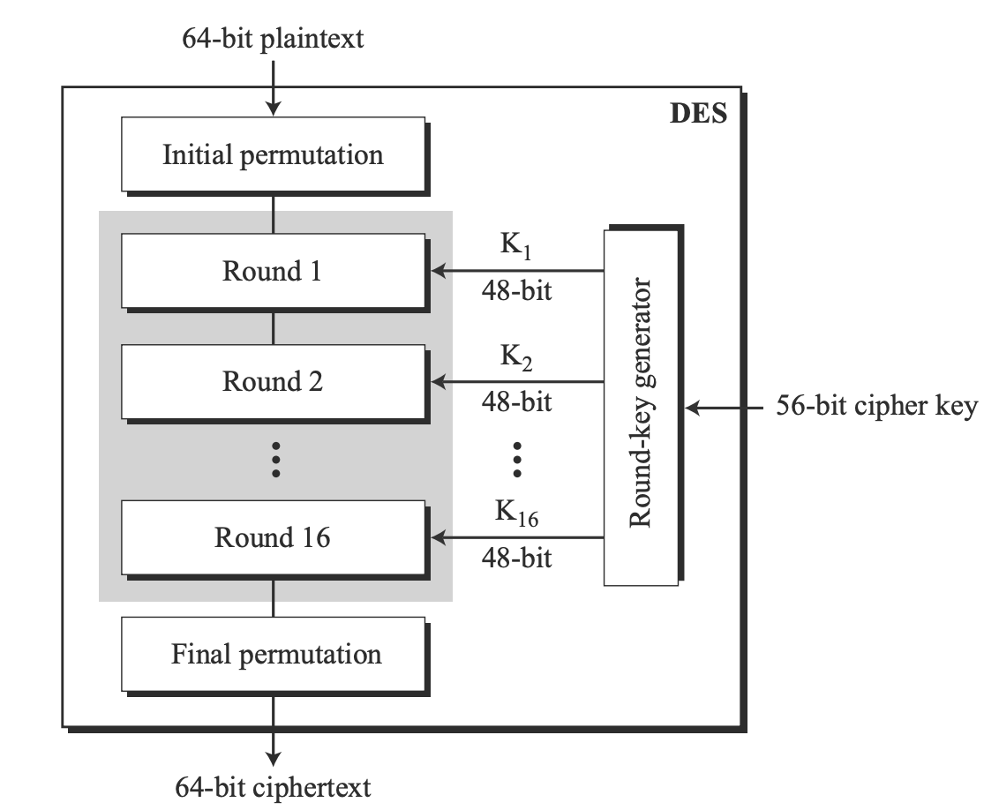
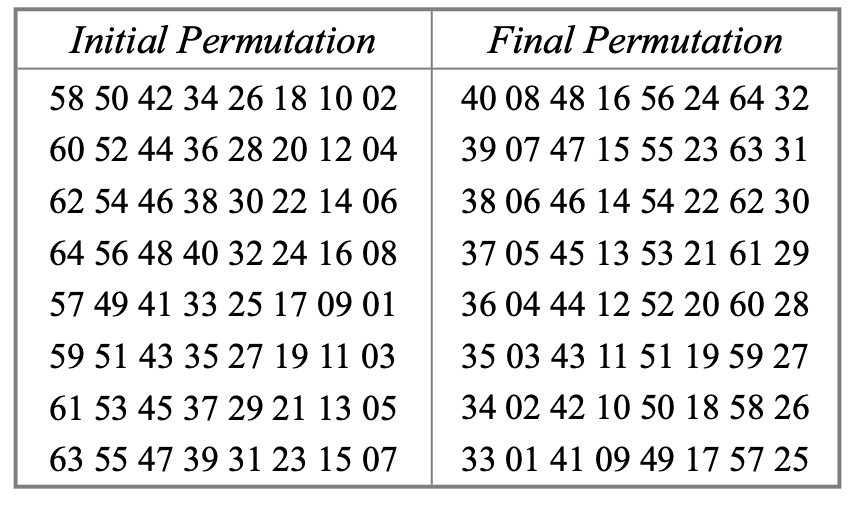
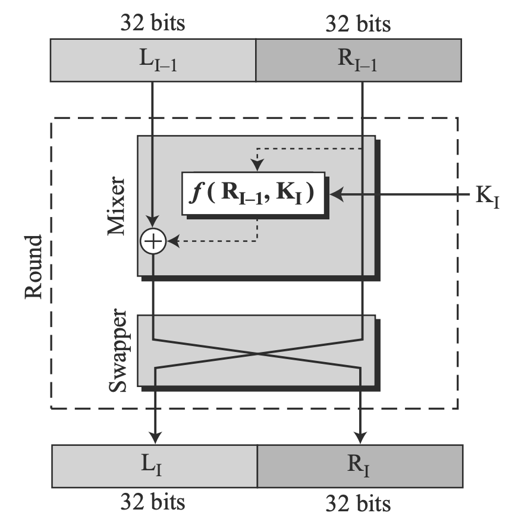
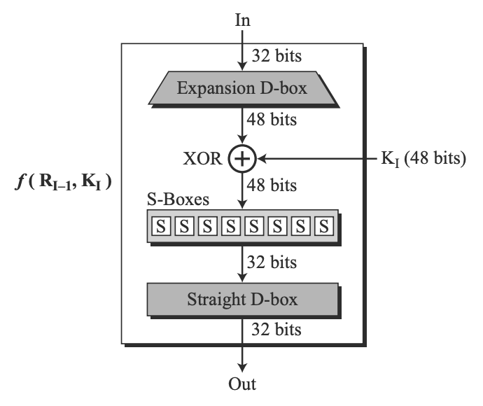
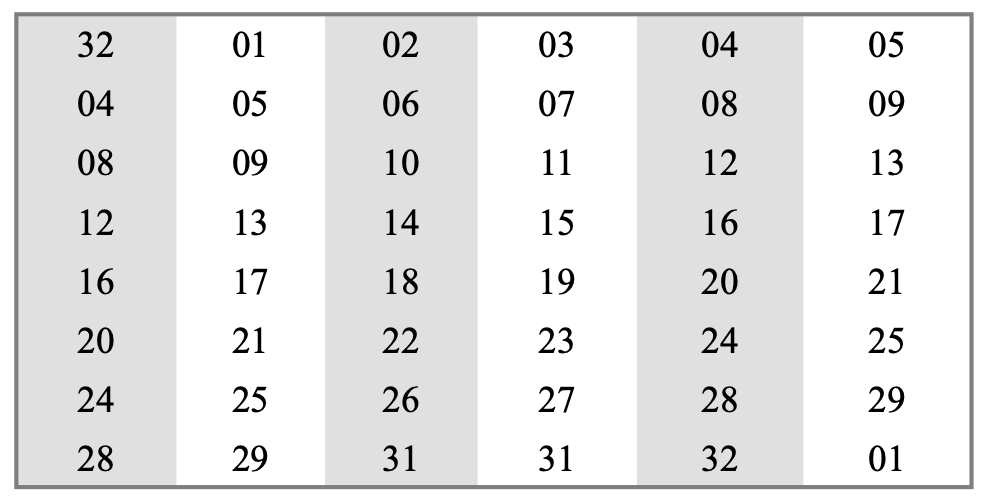
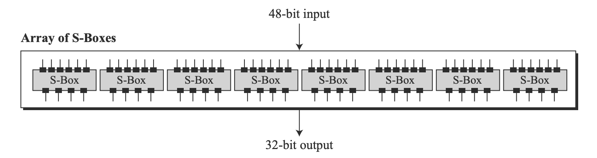
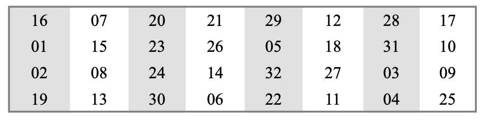
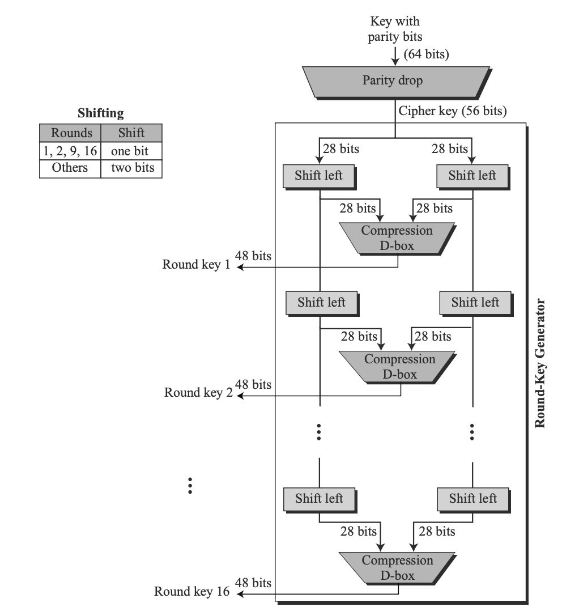
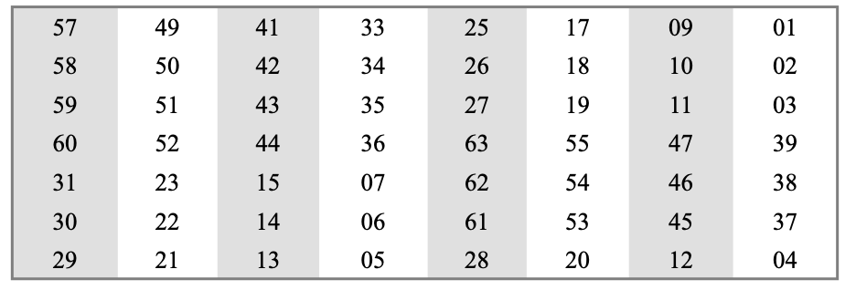
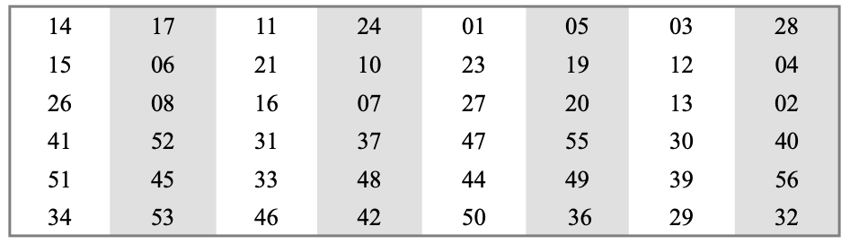

# Feistel Cipher 
The Feistel Cipher is a block encryption algorithm that recursively applies a round function, where each round uses a subkey generated through a subkey generation algorithm from the key. The recursion of a Feistel Cipher makes hardware implementation easier.

## History
* The concept of a Feistel Cipher first originated in the early 1970's when IBM attempted to develop secure banking systems. This resulted in the Lucifer. 
* In 1973, NIST requested national symmetric key cryptosystem algorithms. In response to this, IBM modified the Lucifer to create the Data Encryption Standard, the most common algorithm of the Feistel Cipher. 
* DES was published as the Federal Information Processing System in _The Federal Register_ in March 1975, but people worried that the key bit size was too small and S-boxes would allow messages to be decrypted without a key.
* DES gained respect when it was adopted by the US Government, and used within the National Security Agency.
* Finally, DES was published in _The Federal Register_ as FIPS 46 in January 1977.

## Security Strength
* Key Size: A larger key size means more security.
* Block Size: A larger block size means more security.
* Subkey Generation: Increasing the complexity in how the subkeys are generated from the key increases security.
* Rounds: Increasing the number of rounds, or the number of times a round function is applied, increases security.

## Data Encryption Standard (DES)
* The Data Encryption Standard is the most famous type of Feistel Cipher, and was the most popular encryption method in the 1970s-1990s.
* 64 bit input block
* 64 bit output block
* 64 bit key
* 16 rounds

## Basic Structure

Data Encryption Standard Basic Structure

\

Initial and Final Permutation Tables

\

One Feistel Round

\

F Function

\

Expansion D-Box

\

S Box

\

Straight D-Box (Straight Permutation)

\

Key Generation

\

Parity-Drop Permutation Table

\

Compression D-Box

## Strengths
* The Feistel Cipher has multiple rounds, allowing for more security with a smaller key bit size.
* The Feistel Cipher has similar encryption and decryption algorithms, and uses the same sub-keys, in a reverse order.
* While algorithms such as DES is invertible, the F function does not have to be invertible, meaning that the ciphertext cannot be decrypted.

## Weaknesses
* Weak and semi-weak keys: Block ciphers are often used in hash modes where the key input can be chosen by hackers in an attempt to find collisions.
* Existence of differential attack (if one is possible): Differential attack/cryptanalysis the study of how differences in input can be reflected in the differences of output. The discovery of non-random behavior can be exploited to recover the key.
* Less parallelism: Substitution permutation network (SPN) has more “inherent parallelism,” which means SPN can be computed much faster than Feistel Cipher. But the difference in computing time is more obvious when the computer has a CPU with many execution units.

## Variations
* DES (Data Encryption Standard): 16 rounds, 64-bit block size, 64-bit key with an effective key length of 56 bits (extra 8 bits as parity bits)
* Twofish: 16 rounds, 128-bit block size, key size up to 256 bits (128, 192, 256 bits)
